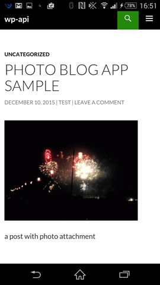
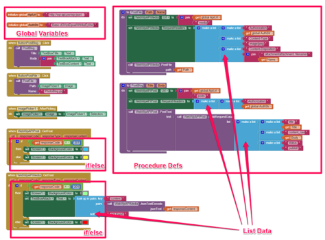

# 簡易Easy Photo Blog 投稿ツール　(Photoblog)

## Project Title.
簡易Easy Photo Blog 投稿ツール

## Elevator Pitch.
このクラウド対応アプリは、スマートフォンの写真ギャラリーから写真を選び、自分のWordPressサイトのメデイアファイルに保存し，この写真を含める投稿を作成する.

## Description.
簡易Easy Photo Blog 投稿ツールはスマートフォンのアプリ、簡単に自分のWordPressサイトに、写真付き投稿するためのもの。次のステップで投稿する:

1. タイトル入力
1. 写真ギャラリーから写真を選び
1. “Post to media”ボタンを押し、WordPressサイトのメデイアファイルに保存する
1. 投稿する内容を入力する
1. “Post Blog”ボタンを押し、写真付き投稿を完了する .

このアプリは、自分のWordPressサイトに写真付き投稿を楽にするものである.

このアプリにもたらす社会的利益は、写真付き投稿が迅速、簡単にできるため、あとでゆっくり見直すできるので, 人々にたくさん投稿するモチベーションを与えること. これも [WordPress REST API](http://wp-api.org/)　使うためのいい実例になる.

 

WordPress REST API対応WordPressサイトに投稿した内容の画面コピー

## Download and Test.
このアプリは WordPress REST API使うため, 全ての機能をテストするには、WordPressにREST APIを入れる必要. こちらの[テストサイト](http://wp-api.pw/)を自由に利用しても構わない. アプリをダウンロードするには、MIT AI2 Companionアプリまたはスキャナーアプリを使っでQRコードをスキャンして、 または [このダウンロードリンクをクリックする](https://sites.google.com/site/chen420/my-apk/PhotoBlog%20%281%29.apk?attredirects=0&d=1).

## Technical Description.
下記の画面コピーにあるように、このアプリはプロジェクトの最低限仕様を満たした。中に 2 個グローバル変数（global variables）, 4 個リストデータ（list data）, 2個関数（procedures or functions）, そして 2 個if/else 構造（structure）が含まれた。

## Appendix.

WP REST APIはWordPressのプラグイン、 将来は WordPressコアに組み入れ、WordPressを ブログプラットフォーム/CMS から、本格的なアプリケーション・フレームワークへ変身するために一歩である。

WP REST API は OAuth 1.0a とBasic Auth 認証方法サポートする。 しかしApp InventorはOAuth 1.0a対応できないため, Basic Authを利用した。Basic Auth はbase64 encodeを利用するが、それもApp Inventorだけでは計算できない, だからこのアプリは、グローバル変数（global variable）に 予めbase64 encode計算した値を入れる。
