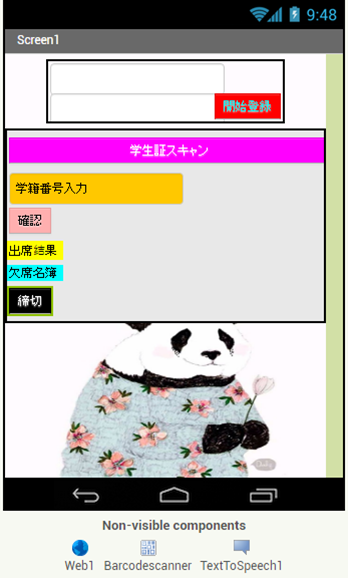
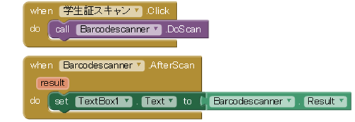
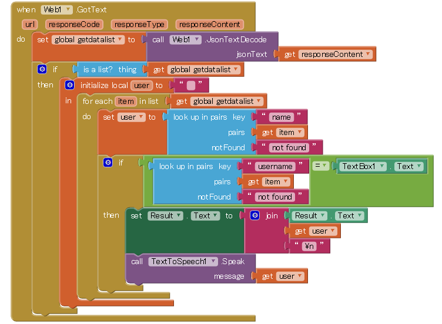
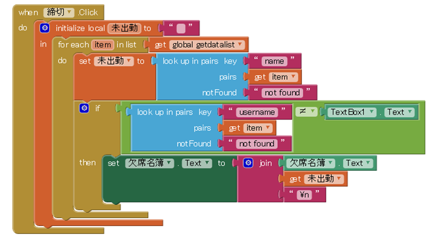
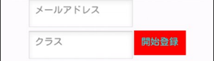

# 出席管理システム　スマホ・アプリの研究

## 　背景

 大学の授業において出席管理方法として点呼による確認と紙による出席票での確認方法がある。学生の名前を読み上げて出席を確認する「点呼」は、少人数の授業の場合には確実に学生本人確認ができることから、最も手堅方法だと言える。しかし、数百名の授業において点呼による出席確認をすると、毎回の出席確認作業は膨大なものと思われる。指定された出席カード（紙）の提出による出席確認の方法は数百人の授業にも採用されている、出席カードの回収と統計には時間がかかる、実際には授業に出席していない学生があたかも出席したかのように見せかける不正行為の可能性を排除できない。両方共に授業中と授業後に出席の確認と統計作業のために時間と労力がかかる。
　
　
## 　目的
 出席管理の時間と労力を削減するために、スマホとクラウト組み合わせでできた出席管理システムを提案する。
本研究の目的は出席管理システムを開発すること。出席を取る時間を大幅に短縮して、統計がすぐにみられるため、先生の負担を軽減し、手作業が少なくなる。また出席の偽登録が防止でき、そしてクラス出席に遅刻する学生へすぐ遅刻催促メールを送信し、学生の出席を促進する。

## 研究内容・方法

### 研究内容

 本研究システムはスマホアプリとクラウドを連携して出席管理システムである。学生のデータは学籍番号で一元管理する。クラウドには学生のリストなど保存する、スマホアプリは出席管理する。私は出席管理システムスマホ・アプリの担当である。スマホアプリは、以下のプログラム予定
1. 学生証のバーコードをスキャンする。
2. クラウドから学生リストを読みこむ。
3. 出席の結果を統計する。
4. 遅れた学生にメールを送信する。

### 研究方法

　AppInventorはAndroid対応アプリケーションソフトウェアを開発するツールである。難解な開発言語を覚える必要はない。パズルを作り上げていくようにアプリケーションを作成することができる。目的に集中するため、本システムはAppInventorを利用して、開発する。

## 画面デザイン

　図１とは画面のデザインである。画面中は上下二つブロックを分けて、上方のブロックは先生の登録部分であり、下方のブロックは学生出席管理画面である。画面下方のWebとは不可視コンポーネントである、HTTPのGET、POST、PUTとDELETEの機能を提供する。
 BarcodeScannerとはバーコードを読み取るための装置のことである。TextToSpeechとはテキストのスピーチ機能を提供する。

## プログラミング
1. 学生証のバーコードのスキャン

　図２とはバーコードをスキャンするプログラムである、学生証のバーコードには学籍番号が含まれる。
 

2. クラウドから学生リストの読みこむ

 図３とは出席者を取得るプログラムである。クラウドと通信して、学生名簿を取得する。

3.  欠席の結果の統計

　図４とは欠席者を取得るプログラムである。循環のプログラムを利用して、欠席する学生のリストをすぐ見られる。
 

1. 担当先生ログイン
　図５とは先生の登録画面である、画面中のメールは出席状況を送信するために使用する。クラスは担任先生のクラス名である。
　例えばた:メールアドレスはｘｘｘｘ＠daiichi-koudai.co.jpとクラス名Aを入れて[開始登録]をクッリクすると、次の画面を移動する。
 

2. 学生証のバーコード読み取り

　学生証スキャンのボタンを押して、出席した学生が順番に学生証をスキャンして、出席を登録する。図６の黄色い部分は出席した学生の名前である。
　学生証スキャンの代わりに学籍番号を入力して出席の認定ももできる。
 

3. 遅刻メール学生に送信

締切のボダンを押して、欠席の結果を統計し、同時に遅刻した学生へ遅刻催促メールを送信する。図６の青い部分は欠席した学生の名前である。　
　　　　　　　
## 結果・考察

　本研究では開発した出席管理システムスマホ・アプリで簡単に学生証のバーコードをスキャンして、出席できて、または学籍番号を入力して出席もできる。出席者と欠席者の状況すぐ見られる。遅刻メール学生に送信する機能は未実装のため、応用効果が制限されて、今後の課題とする。本システム導入により、出席をとる時間がかかり、出席状況の確認し辛い状況を改善し、先生の負担を軽減し、生徒と向きあう時間を増やす、そして学生の学習意欲を向上する効果が期待する。

## 結論

　本研究ではスマートフォンから簡単に出席を取る。遅刻した学生をすぐ見られた。今後の課題としては、スマートフォンで遅刻メール学生に送信する。バーコード以外の非接触ICカードを利用して簡単に出席を取る。

